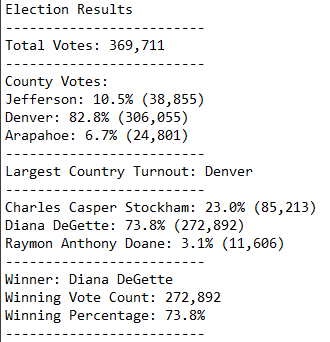
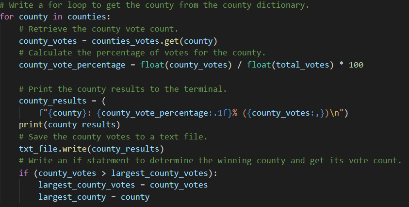
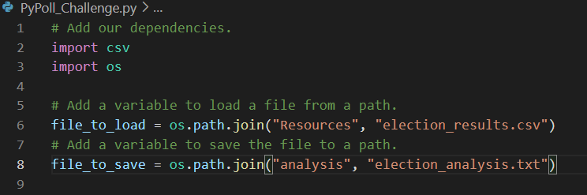
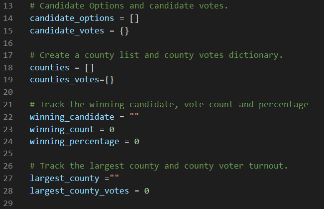

# Election Analysis

## Overview of Election Audit
In order to complete the audit of a recent local congressional election in Colorado, the tasks listed below were performed.  Data from a CSV file was read into a a Python program where it was sorted and counted and used to calculate percentages of votes for both the candidates and countied involved.  This was done at the request of an employee from the Colorado Board of Elections.  

### Tasks Performed
1. Calculate the total number of votes cast.
2. Determine the voter turnout for each county
3. Calculate the percentage of votes from each county out of the total count
4. Determine the county with the highest turnout
5. Get a complete list of candidates  who received votes.
6. Calculate the totatl numnber of votes each candidate received.
7. Calculate the percentage of votes each candidate won.
8. Determine the winner of the election based on popular vote.

### Resources
- Data Source: election_results.csv
- Software: Python 3.9.7

## Election-Audit Results
The analysis of the election can be broken down into two parts: the counties and candidates involved.  

### The Counties
- There were 369,711 votes cast in this congressional election.
- The counties involved were:
  - Jefferson
  - Denver
  - Arapahoe
- The breakdown of votes by county were:
  - Jefferson County had 10.5% of the vote with 38,855 voters
  - Denver County had 82.8% of the vote with 306,055 voters
  - Arapahoe County had 6.7% of the vote with 24,801 voters
- The county with the largest turnout was Denver
  
### The Candidates
- The candidates were:
  -   Charles Casper Stockham
  -   Diana DeGette
  -   Raymon Anthony Doane
- The candidate results were:
  -   Charles Casper Stockham received 23.0% of the vote and 85,213 votes.
  -   Diana DeGette received 73.8% of the vote and 272,892 votes.
  -   Raymon Anthony Doane received 3.1% of the vote and 11,606 votes.  
- The winner of the election was:
  -   Diana DeGette, who received 73.8% of the vote and 272,892 votes.     

### The Code
Below is screenshot summarizing all of the voting results.  The voting data were read into a Python program which after counting and making calculations,  printed the results into a separate text file for later use.  

A snippet of the Python code used to count the votes can be seen in the screenshot below.  Additionally, the percentages of votes were also calculated within the code.

## Election-Audit Summary
The current script created in Python and used for this analyis can be re-purposed and used for any election.  For example, in the beginning of the script the user can easily modify which data is read into the program and also easily choose where the output is written.  In the screenshot of the code below, the "file to load" and "file to save" options can easily be modified and used for data in other elections.  

The type or level of election the software can analyze can also be easily modified.  Once again, at the beginning of the program the variable lists and dictionaries can easily be changed to accommodate city or national elections.  In the code below, counties can be changed to cities or states, or lists and dictionaries can easily be added if the voting involves city, state and federal candididates or proposals on the ballot.  

